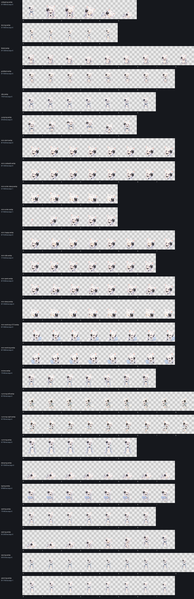

# Xuerong for Clawd on Desk

[繁體中文](README.md)

Xuerong (雪絨) is a white ragdoll catgirl desktop companion theme for Clawd on Desk. This repository contains the Xuerong 2.1.3 theme, a safe theme-only installer for Clawd 0.12.0, and the complete corresponding source for the legacy Clawd 0.10.0 Windows runtime patch.



## Easiest install (recommended for Clawd 0.12.0)

Download `Xuerong-HD-Theme-Installer.exe` from [GitHub Releases](https://github.com/RoyalMilkteaMaster/xuerong-clawd/releases) and double-click it. It installs only the Xuerong theme for the current Windows user, does not replace `app.asar`, and does not require administrator privileges.

Restart Clawd, open `Settings → Theme`, then select “Xuerong HD” under user themes. Running the EXE again updates the theme. To remove it:

```powershell
.\Xuerong-HD-Theme-Installer.exe /uninstall
```

If you prefer not to run a third-party EXE, download `Xuerong-HD-Clawd-Theme.zip` and choose `Settings → Theme → Import Clawd theme package (.zip)`. This uses Clawd 0.12.0's built-in importer.

> Windows may show SmartScreen because the installer does not have a commercial code-signing certificate. Use the ZIP path instead if you do not want to bypass a warning.

## Features

- Full Xuerong animation set, including idle, work, typing, sleep, wake, grab, and reactions.
- Dedicated left/right edge-mode animation rather than a scaled full-body pose.
- Free two-axis dragging from edge mode and smart edge-mode selection on release.
- Up to 50% of the visible character may cross an outer screen edge.
- Clawd-style Session HUD with current work location, state, and context progress.
- Codex `request_user_input` questions appear as HUD option cards.
- Clicking an option copies its label and opens Codex; Codex remains responsible for final submission.
- Existing Clawd installation and preferences are backed up before installation.

## Requirements

- Theme-only installer: Windows 10/11 and Clawd on Desk 0.12.0. The ZIP also works on other platforms supported by Clawd.
- Full patched runtime: Windows 10/11 x64, Clawd on Desk 0.10.0, and PowerShell 5.1 or later.

The old full-runtime installer accepts the official 0.10.0 x64 `app.asar` and this repository's already-patched build. Do not use `-ForceUnsupported` on 0.12.0: it replaces the 0.12.0 core with an older core instead of safely merging features.

## Clawd 0.12.0 compatibility

| Feature | Theme EXE/ZIP on stock 0.12.0 |
|---|---|
| Normal, sleep, grab, and reaction animations | Works |
| Dedicated left/right edge visuals | Works |
| Stock Session HUD and progress information | Works when the agent integration is healthy |
| Free X/Y dragging directly from edge mode with smart release | Not included; this is a patched-runtime feature |
| Custom Codex `request_user_input` HUD option cards | Not included; this is a patched monitor feature |
| New 0.12.0 WSL, Remote Approval, Discord, and other features | Preserved because the theme installer does not patch the core |

The theme passes Clawd 0.12.0's official `validate-theme.js` and ZIP importer. Keeping all 0.12.0 features plus every custom Xuerong interaction requires a separate port of the runtime changes; this theme-only installer intentionally does not do that.

## Install

The instructions below are only for the full patched runtime on Clawd 0.10.0.

Download and extract the release ZIP, open PowerShell in the extracted folder, then run:

```powershell
Set-ExecutionPolicy -Scope Process Bypass
.\installer\install.ps1
```

Validation without changing the computer:

```powershell
.\installer\install.ps1 -ValidateOnly
```

Restore the most recent pre-install backup:

```powershell
.\installer\restore.ps1
```

The backup is stored under `%APPDATA%\clawd-on-desk\xuerong-backups`.

## Safe settings

The installer merges only the keys in [settings/xuerong-defaults.json](settings/xuerong-defaults.json). It does not replace session aliases, remote SSH settings, Telegram settings, agent configuration, hardware settings, or work history.

## Source and provenance

- Upstream: [rullerzhou-afk/clawd-on-desk](https://github.com/rullerzhou-afk/clawd-on-desk)
- Upstream base commit: `9ccafb84680d7068baa35e2d91c0800f81c7b475`
- Upstream application version: `0.10.0`
- Xuerong theme version: `2.1.3`
- Xuerong runtime package version: `0.11.0`

The original upstream documentation is retained in [docs/UPSTREAM-README.md](docs/UPSTREAM-README.md).

## Development and validation

```powershell
npm ci
npm test
powershell -ExecutionPolicy Bypass -File .\scripts\validate-release.ps1
powershell -ExecutionPolicy Bypass -File .\installer\build-theme-installer.ps1
powershell -ExecutionPolicy Bypass -File .\installer\test-theme-installer.ps1
```

The focused Xuerong regression suite is documented in [docs/VALIDATION.md](docs/VALIDATION.md).

## License

Clawd on Desk and the modified source are distributed under the GNU Affero General Public License v3.0. See [LICENSE](LICENSE) and [NOTICE.md](NOTICE.md).

Xuerong character art and animation assets use the separate personal, non-commercial grant in [ASSET-LICENSE.md](ASSET-LICENSE.md).
